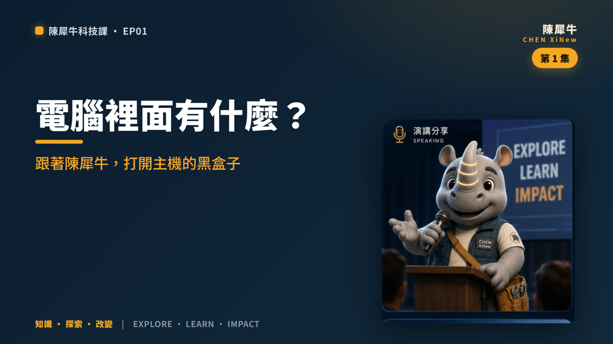

<div align="center">

# 陳犀牛科技課 · XiNewVideos

### 用好奇心探索世界，用知識改變未來！

**陳犀牛 Chen XiNew 的教學影片產出庫　|　EXPLORE · LEARN · IMPACT**



</div>

---

## 這是什麼 What is this

這個 repo 是 **陳犀牛 IP 教學影片的產出與產線基地**，把兩個來源融合在一起：

| 來源 | 提供什麼 | 對應在這裡 |
|---|---|---|
| [video-production-skill-kimi](https://github.com/pcpcchen-coder/video-production-skill-kimi) | **教學影片產線**（腳本 → 投影片 → 配音 → 字幕 → 組裝 → 驗收） | `toolkit/` |
| [XiNewIPs](https://github.com/pcpcchen-coder/XiNewIPs) | **陳犀牛 IP 素材**（品牌識別、角色設定、12 種表情、3D 姿勢） | `assets/`、`brand/` |

> 融合的核心概念是 **「以 IP 為講師」**：每一支影片都由 3D 角色 **陳犀牛** 當主講人登場，
> 用他的口吻帶你把艱深的知識變有趣。第一集《電腦裡面有什麼？》就是這個作法的第一個成品。

---

## 🎬 第一集 · 《電腦裡面有什麼？》

> 主檔：[`videos/ep01-what-is-inside-a-computer/video_sub.mp4`](videos/ep01-what-is-inside-a-computer/video_sub.mp4)（燒入字幕成品）

- **主題**：打開主機殼，用「一間廚房」的比喻認識電腦的五個單元（輸入 / 處理 / 記憶 / 儲存 / 輸出）。
- **講師**：陳犀牛（3D 角色登場，每張投影片依內容切換表情）。
- **風格**：品牌深海藍 + 探索橙的科技感投影片，繁體中文，1920×1080。
- **片長**：約 4 分 15 秒 · 10 張投影片 · 77 句字幕。
- **改編自** kimi repo 的 `examples/cs-course/videos/v01`，並全面換上陳犀牛的人設與品牌視覺。

### ⚠️ 關於配音（請先看這段）
本沙盒的網路政策**封鎖了所有雲端／神經 TTS 服務主機**（edge-tts 的 `speech.platform.bing.com`、
Google、HuggingFace 皆回 403），且環境內沒有離線語音引擎。因此**這一版是「無語音 + 燒入字幕」的完整剪輯**，
旁白內容 100% 以字幕逐句呈現，節奏、視覺與講師演出都可以完整預覽。

配音的產線**已經寫好**（`toolkit/tts.py`，用免費的 edge-tts 台灣男聲 `zh-TW-YunJheNeural`）。
只要在**允許連到 TTS 主機的環境**（例如本機或原本的 Kimi 沙盒）跑一次，語音就會自動接上、字幕改用真實語音長度對齊。
詳見 [`docs/TOOLCHAIN.md`](docs/TOOLCHAIN.md)。

---

## 🧰 工具鏈替代（原產線缺的工具，怎麼補齊的）

原 kimi 產線是為 **Kimi 沙盒**設計的（用 Kimi 生圖/配音插件、ElevenLabs、faster-whisper）。
這些在本環境都不存在，因此改用**完全免費、可在本環境跑**的替代方案：

| 步驟 | 原本用（缺） | 這裡改用 | 為什麼更好 / 備註 |
|---|---|---|---|
| 投影片 | Kimi `image_generation` 插件 | **HTML/CSS + Playwright/Chromium 截圖** | 中文零亂碼、數字不亂編、品牌 100% 可控 |
| 配音 | Kimi `audio_generation` / ElevenLabs | **edge-tts**（`zh-TW` 神經男聲） | 免費；惟本沙盒封鎖其主機，需在可連線環境執行 |
| 字幕對齊 | OpenAI / faster-whisper ASR | **依旁白字數 / 真實語音長度推算** | 不需 ASR；有語音時自動改用實際長度 |
| 影像處理 | 系統 `ffmpeg` | **imageio-ffmpeg 靜態版**（ffmpeg 7.x） | 內含 libx264 / aac / libass |
| 中文字型 | 系統 Noto Sans CJK | **由 npm `@fontsource/noto-sans-tc` 合併重建** | 4 字重、完整標點/箭頭覆蓋，已收錄於 `brand/fonts/` |

> 完整的踩坑與解法（apt 封鎖、字型子集缺標點、憑證信任、TTS 403…）記在 [`docs/TOOLCHAIN.md`](docs/TOOLCHAIN.md)。

---

## 📁 檔案樹 File Tree

```text
XiNewVideos/
├── README.md                     # 你正在看的：總覽 + 工具鏈 + 如何做下一支
├── brand/
│   ├── tokens.json               # 品牌設計 token（色票 / 字級 / 標語）
│   └── fonts/                    # Noto Sans TC 四字重 ttf（投影片 + 字幕共用）
├── assets/
│   ├── instructor/               # 陳犀牛講師素材：12 表情 + 4 姿勢（由 XiNewIPs 擷取）
│   └── brand/                    # 主視覺 / Logo（供封面與文件引用）
├── toolkit/                      # ⭐ 可重複使用的產線（本環境版）
│   ├── setup.sh                  #   一鍵重建環境
│   ├── build_episode.sh          #   一鍵產一支影片（lint→配音→投影片→字幕→組裝→驗收）
│   ├── render_slides.py          #   HTML → 1920×1080 PNG（Chromium）
│   ├── tts.py                    #   edge-tts 配音
│   ├── build_subtitles.py        #   時長推算 + SRT/ASS 字幕
│   ├── assemble.py               #   投影片(+配音) → video.mp4 → 燒字幕 → 封面
│   ├── lint_narration.py         #   旁白 lint（配音前必過）
│   ├── verify.py                 #   交付驗收（本集 16/16 PASS）
│   └── template/slide.html       #   品牌投影片模板（版型引擎 + SVG 圖示）
├── docs/
│   ├── PRODUCTION_GUIDE.md        #   五步產線與指令
│   ├── TOOLCHAIN.md              #   工具鏈替代與踩坑排解
│   └── IP-INSTRUCTOR.md          #   陳犀牛講師人設：口吻 / 表情對應 / 品牌規範
└── videos/
    ├── README.md                 #   影片索引
    └── ep01-what-is-inside-a-computer/   # 第一集（完整成品 = 範本）
        ├── plan.md · config.json
        ├── narration.json        #   旁白腳本（陳犀牛口吻，10 段）
        ├── storyboard.json       #   分鏡（版型 + 表情）
        ├── slides_spec.json      #   投影片結構化內容（餵給模板）
        ├── slides/               #   slide_01–10.png
        ├── audio/                #   配音 slide_NN.mp3（有 TTS 環境才會生成）
        ├── subtitles/            #   subtitles.srt / subtitles.ass
        ├── slide_durations.json
        ├── video.mp4             #   無字幕
        ├── video_sub.mp4         #   ⭐ 燒字幕成品（主交付）
        └── thumbnail.jpg         #   封面 1280×720
```

### 後續影片放哪？
每一支新影片一個資料夾：**`videos/epNN-<英文短名>/`**（例：`videos/ep02-zero-and-one/`）。
`videos/README.md` 是索引表，新增一支就在表格補一列。第一集資料夾即為「做好的樣子」範本，直接複製即可。

---

## 🚀 如何做下一支影片 Make the next episode

```bash
# 0) 一次性：重建環境（字型 / ffmpeg / playwright / edge-tts）
bash toolkit/setup.sh

# 1) 從第一集複製成範本
cp -r videos/ep01-what-is-inside-a-computer videos/ep02-zero-and-one
cd videos/ep02-zero-and-one && rm -rf slides audio/* subtitles video*.mp4 thumbnail.jpg && cd -

# 2) 改三個檔案：narration.json（陳犀牛口吻旁白）、slides_spec.json（投影片內容）、storyboard.json（版型+表情）
#    口吻與表情對應請參考 docs/IP-INSTRUCTOR.md

# 3) 一鍵產出（自動：lint → 配音(若可) → 投影片 → 字幕 → 組裝 → 驗收）
bash toolkit/build_episode.sh videos/ep02-zero-and-one
```

> 換主題其實只要重寫那三個 JSON，其餘（版型、品牌、講師、產線）全部重用。

---

## 📚 想深入時讀哪一份

| 想知道… | 讀這份 |
|---|---|
| 五步產線與每個指令 | [`docs/PRODUCTION_GUIDE.md`](docs/PRODUCTION_GUIDE.md) |
| 缺工具怎麼補、踩坑排解 | [`docs/TOOLCHAIN.md`](docs/TOOLCHAIN.md) |
| 陳犀牛講師的口吻與表情規範 | [`docs/IP-INSTRUCTOR.md`](docs/IP-INSTRUCTOR.md) |
| 一支「做好的樣子」 | [`videos/ep01-what-is-inside-a-computer/`](videos/ep01-what-is-inside-a-computer/) |

---

<div align="center">

**陳犀牛 Chen XiNew** — 讓知識變得有趣，讓學習成為冒險！　*Stay Curious, Keep Growing.*

融合來源：[video-production-skill-kimi](https://github.com/pcpcchen-coder/video-production-skill-kimi) × [XiNewIPs](https://github.com/pcpcchen-coder/XiNewIPs)

</div>
